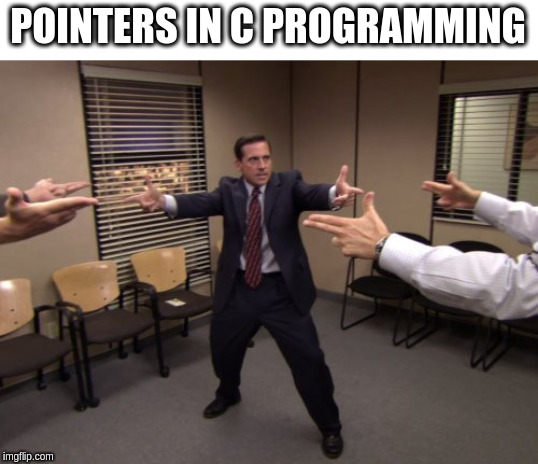
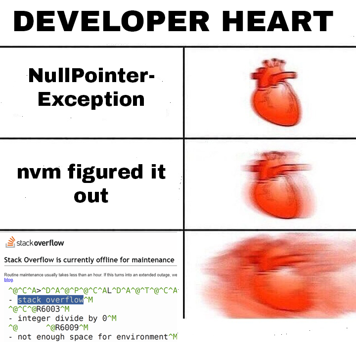

# Explication des Paramètres JVM pour les Tests

Ce document décrit les différents paramètres JVM utilisés dans les tests. Chaque configuration simule un environnement unique pour tester divers aspects de la gestion de la mémoire et des performances de la JVM.

## TODO : Tester sur des systèmes d’exploitation différents ?

## 1. Mémoire allouée

**Description** : Cette configuration attribue 512 Mo de mémoire minimale et 1024 Mo de mémoire maximale à la JVM. Ce paramètre est utile pour tester le comportement de l'application dans un environnement à mémoire limitée.

**Objectif du Test** : Tester la performance de l'application lorsque la mémoire allouée est restreinte. Cela permet d'identifier si des exceptions `OutOfMemoryError` ou des ralentissements significatifs surviennent lorsque la mémoire est insuffisante. Les parsers doivent parfois charger la quasi-totalité d'un texte dans le contexte du processus. Limiter le heap de la JVM a donc un impact significatif.

**Résultat Exécution** : En comparant les différents temps d'exécution des pipelines, on ne voit aucun changement significatif.

**Résultat Couverture** : Le coverage est identique, donc le comportement est conforme aux attentes.

---

## 2. Différents garbage collectors

### Impact global d'un collecteur spécifique sur les parsers :

**Description** : Le garbage collector G1GC (Garbage-First Garbage Collector) est conçu pour les applications nécessitant des latences faibles tout en ayant une utilisation modérée de la mémoire. Avec cette configuration, on alloue entre 1024 Mo et 2048 Mo de mémoire.

**Objectif du Test** : Évaluer les performances et la réactivité de l'application avec un garbage collector optimisé pour réduire les pauses prolongées. Ce test est particulièrement utile pour des applications en production qui nécessitent une réponse rapide sans interruption prolongée.

**Description du 2ème garbage collector** : ZGC (Z Garbage Collector) est un garbage collector à faible latence, spécialement conçu pour minimiser les temps de pause, même pour des applications à mémoire élevée. Cette configuration alloue un minimum de 512 Mo et un maximum de 2048 Mo.

**Objectif du Test** : Mesurer les avantages du ZGC en termes de latence pour les applications nécessitant des traitements rapides, notamment lorsque la charge mémoire est élevée. ZGC est particulièrement utile dans les systèmes à haute disponibilité où chaque milliseconde compte.

**Description du 3ème garbage collector** : Ce garbage collector exécute les collections de façon multithreadée et fonctionne mieux sur des systèmes avec beaucoup de mémoire disponible.

**Objectif du Test** : Tester la copie des collections en mode multithreadé et vérifier qu’il n’y a pas de race conditions, qui pourraient être des bugs critiques. Ce test évalue également la performance du multithreading.

**Description du 4ème garbage collector** : Ce dernier garbage collector multithreade la copie de la collection et arrête les différents threads pendant la collecte. Sa différence avec le collecteur précédent est que son algorithme est optimisé pour des heaps de plus de 10 Go. Notez que cette option n'était pas disponible pour JDK 17, qui est la version de base de ce dépôt. Les détails de mes recherches sont dans le README car ils restent intéressants.

[Différence entre `-XX:+UseParallelGC` et `-XX:+UseParNewGC`](https://stackoverflow.com/questions/2101518/difference-between-xxuseparallelgc-and-xxuseparnewgc)

**Objectif du Test** : Sur des ordinateurs multicoeurs (maintenant standard), nous voulons que nos programmes s'exécutent en multithread, même avec une quantité limitée de RAM. Ce test observe les performances en restreignant la mémoire disponible, pour assurer l'efficacité du programme dans ces conditions.

**Résultats Exécution** : En comparant les temps d'exécution des différentes pipelines, aucun changement significatif n'est observé.

**Résultats Couverture** : La couverture reste la même, ce qui indique un comportement attendu.

---

## 3. Compression des pointeurs d'objets

**Description** : L'option `UseCompressedOops` compresse les références d'objets, réduisant ainsi l'empreinte mémoire pour les applications fonctionnant dans un espace mémoire de moins de 32 Go. Cette configuration alloue entre 1024 Mo et 4096 Mo.

**Objectif du Test** : Optimiser la gestion de la mémoire pour des applications utilisant de grandes quantités de données. Ce test évalue l'efficacité de la JVM à compresser les références, utile pour les applications manipulant intensivement des données tout en réduisant la consommation de mémoire. Les parsers étant des programmes manipulant de nombreux pointeurs, cette option pourrait impacter leur performance.

---

## 4. Utilisation des priorités de threads, utile pour détecter les race conditions

**Description** : L'option `-XX:+UseThreadPriorities` dans la JVM active l’utilisation des priorités de threads Java natives du système d'exploitation. Cela permet de mapper les priorités des threads Java (de 1 à 10) sur celles du système d'exploitation sous-jacent. Cependant, l’effet de cette option dépend de la compatibilité du système d'exploitation ; par exemple, elle peut être efficace sous Windows, mais avoir peu d'effet sous Linux, où les priorités de threads ne sont pas toujours supportées nativement. Par défaut, cette option est parfois désactivée pour éviter des comportements imprévisibles dans certains environnements.

**Objectif du Test** : Dans un parser, de nombreuses opérations sont multithreadées. Changer la priorité des opérations aide à vérifier si des race conditions peuvent être déclenchées. Cela permet aussi d'évaluer les performances du multithreading avec des priorités différentes.

---

## 5. Taille des piles de threads – Plus de StackOverflows !

**Description** : L'option `-Xss256k` dans la JVM définit la taille de la pile (stack) pour chaque thread Java à 256 Ko. Cela signifie que chaque thread dispose d'une quantité fixe de mémoire pour sa pile, où sont stockées les informations d’appel de fonctions et les variables locales. Cette option est cruciale pour contrôler la consommation de mémoire dans des applications multithreadées : une pile plus petite permet de lancer davantage de threads en parallèle, mais peut entraîner des erreurs de dépassement de pile (`StackOverflowError`) si les appels de méthodes sont trop profonds.

**Objectif du Test** : Dans un parser, qui effectue souvent de nombreuses opérations récursives ou profondes, réduire la taille de la pile peut aider à identifier les points de défaillance potentiels dus à une allocation de mémoire limitée pour chaque thread. Ce test permet de vérifier la gestion de la mémoire des threads par le parser et de détecter les erreurs de dépassement de pile dans un environnement à forte charge.

## Documentation humoristique

Nous avons ajouté des mèmes dans cette page et modifié les noms des builds de manière humoristique tout en gardant leur signification.

- "Maven tests avec différents environnements et drapeaux JVM, mais pas le drapeau français"
- "Exécution de tests Maven avec des flags, mais pas dans un parc Six Flags."
